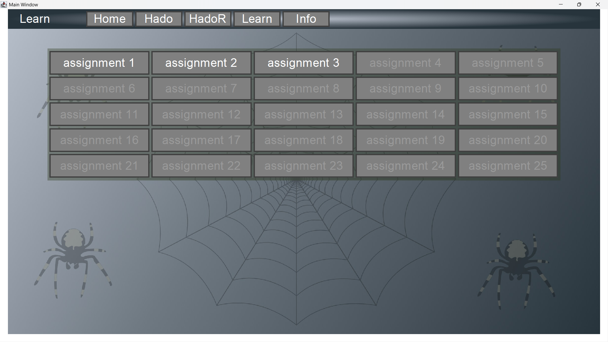
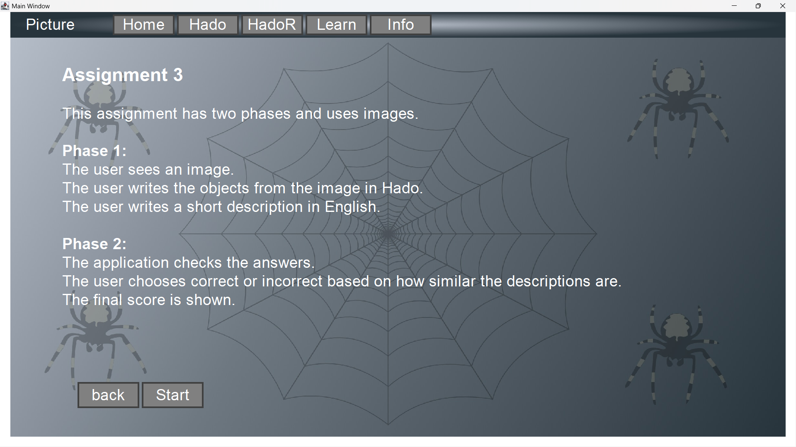
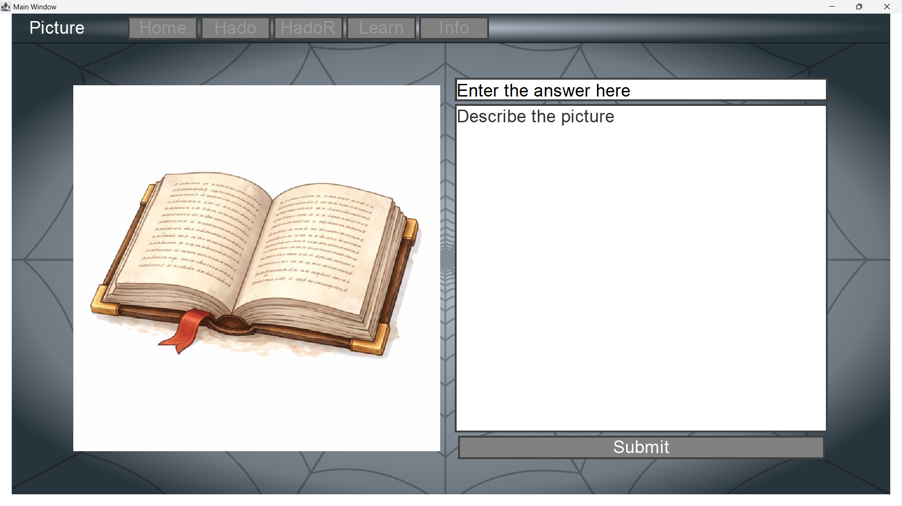
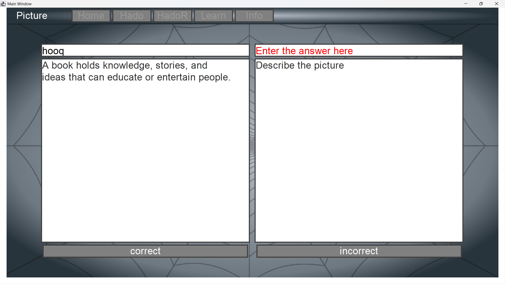
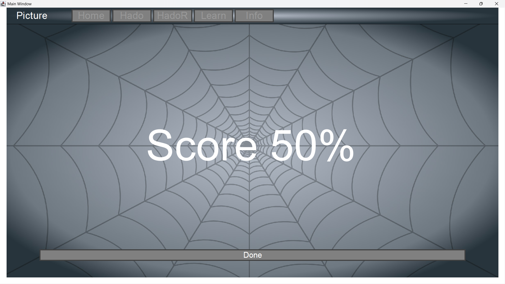

## 🕷️Spider🕸️

---

### Brief explanation

In my spider project, I'm creating a translation for my own language called Hado (not a coding language).
I'm still learning, so I'm tackling new topics that I haven't explored yet with Java.

### Technologies Used

| Java                                                                               | Maven                                                                                 | MariaDB                                                                                     |
|------------------------------------------------------------------------------------|---------------------------------------------------------------------------------------|---------------------------------------------------------------------------------------------|
|  |  |  |

### Explanation per screen

#### Login screen

In this screen you must log in to access the translator.

#### Home screen

On the home screen there are sort of small
explanations of what each screen does (besides the home, login screens).

#### Hado translate screen

on the hado screen, the top field is for your own language if you click on translat
it will be set to Hado language in the bottom field.

#### HadoR translate screen

On the HadoR screen you can set Hado language back to your own language,
it works the same as on the Hado Screen.

#### Hado Learning Screen

Here are the buttons for the assignment to learn hado

#### words assignment explanation

here is the explanation of assignment 1

#### assignment words (assignment 1)

here are assignment words

#### Sentences assignment explanation

here is the explanation of assignment 2

#### assignment words (assignment 2)

here are assignment Sentences

#### Picture assignment explanation

here is the explanation of assignment 3

#### assignment Picture (assignment 3)

here is the assignment picture

#### info Screen

here is the information about my language (hado)

---

### what I'm still working on

- Small bugs

---

### ideas that are coming

- User ID and password security
- work with a database
- keep a catalog for translation words
- working with hibernate

---

    

